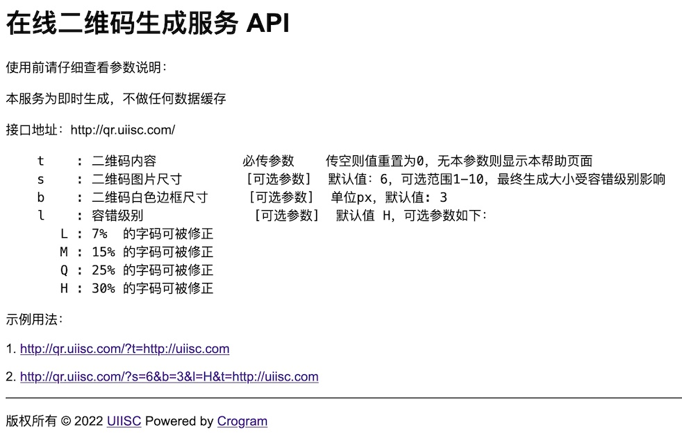

# PHP在线二维码生成服务API源码

演示：http://qr.uiisc.com



PHP源码，动态生成二维码，即时生成不做缓存

使用前请仔细查看参数说明：

本服务为即时生成，不做任何数据缓存

接口地址：http://qr.uiisc.com/

```
    t    : 二维码内容           必传参数    传空则值重置为0，无本参数则显示本帮助页面
    s    : 二维码图片尺寸        [可选参数]  默认值：6，可选范围1-10，最终生成大小受容错级别影响
    b    : 二维码白色边框尺寸     [可选参数]  单位px，默认值: 3
    l    : 容错级别              [可选参数]  默认值 H，可选参数如下：
       L : 7%  的字码可被修正
       M : 15% 的字码可被修正
       Q : 25% 的字码可被修正
       H : 30% 的字码可被修正
```

示例用法：

1. http://qr.uiisc.com/?t=http://uiisc.com

2. http://qr.uiisc.com/?s=6&b=3&l=H&t=http://uiisc.com
